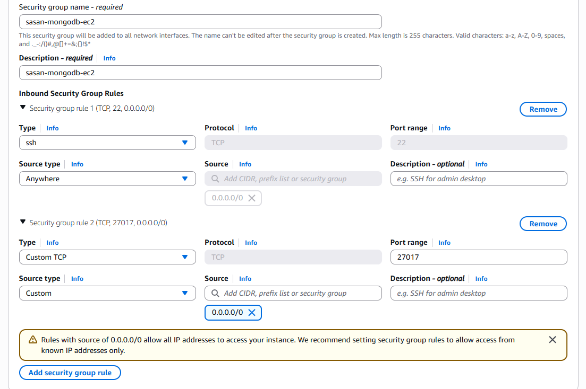
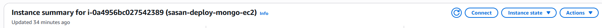
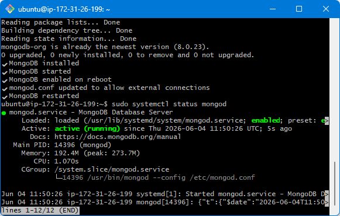
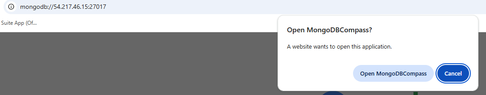
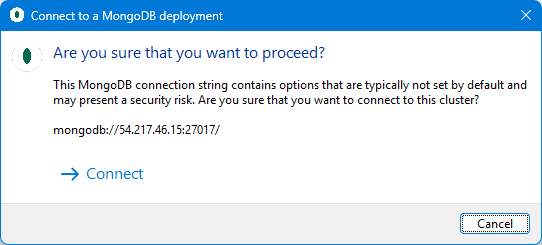
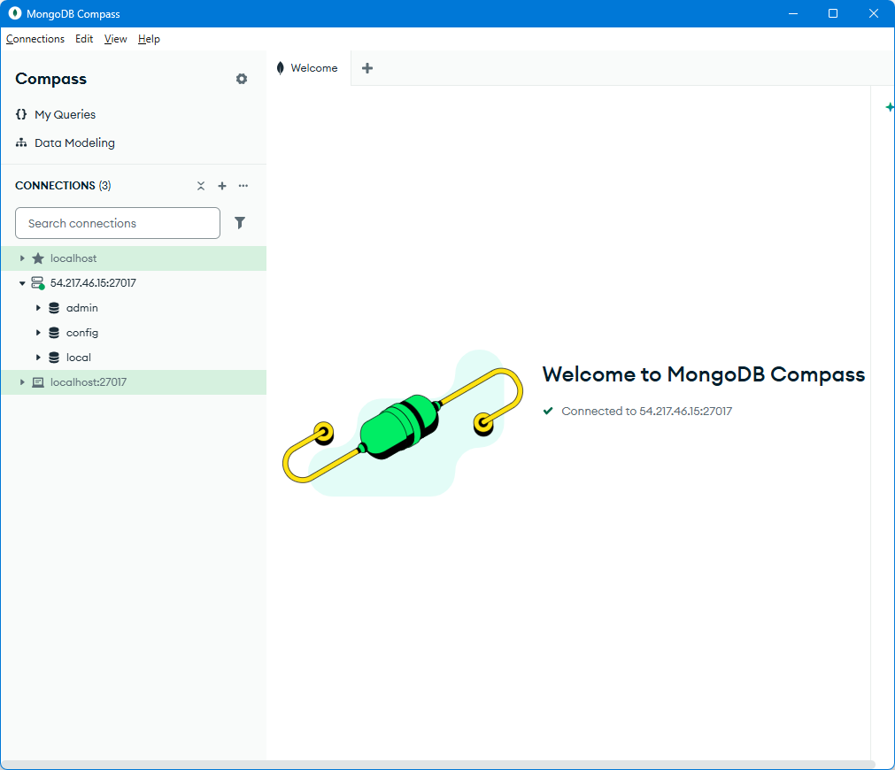

# Deploying MongoDB on an EC2 Instance

This guide walks through launching an EC2 instance and deploying MongoDB on it, then connecting to it remotely via MongoDB Compass.

---

## 1. Launch an EC2 Instance

Follow the same steps as the [EC2 setup guide](ec2-setup.md), with these differences:

- **Name:** `sasan-deploy-mongo-ec2` (or similar)
- **AMI:** Ubuntu 24.04
- **Instance type:** t3.micro
- **Storage:** leave defaults unchanged

---

## 2. Configure the Security Group

You need two inbound rules:

| Port | Source | Purpose |
|------|--------|---------|
| 22 | 0.0.0.0/0 | SSH access |
| 27017 | 0.0.0.0/0 | MongoDB external access |



> **Why port 27017?**
> This is MongoDB's default port. Opening it in the security group allows external clients (like MongoDB Compass on your laptop) to reach the database. Without this rule, all connection attempts would be blocked at the firewall before even reaching MongoDB.

---

## 3. Select Key Pair and Launch

Select your existing key pair (`se-sasan-key-pair`) and launch the instance. Once running, note the **Public IPv4 address** from the instance dashboard.



---

## 4. Upload the Deploy Script

From your local `.ssh` folder in Git Bash, copy the script to the instance:

```bash
scp -i "se-sasan-key-pair.pem" /c/Users/helpp/Desktop/starwars-mongodb-and-cloud-computing/scripts/deploy-mongo.sh ubuntu@<your-public-ip>:~/
```

> `scp` (Secure Copy) transfers files over SSH using the same key authentication. The file lands in the home directory (`~/`) of the instance.

---

## 5. SSH Into the Instance

```bash
ssh -i "se-sasan-key-pair.pem" ubuntu@<your-public-ip>
```

---

## 6. Run the Deploy Script

Make the script executable and run it:

```bash
chmod +x deploy-mongo.sh
./deploy-mongo.sh
```

The script runs the following steps automatically, printing a `✔` message after each one:

### Step 1 — Update and upgrade packages
```bash
sudo apt update -y
sudo apt upgrade -y
```
Fetches the latest package list and upgrades all installed packages.

### Step 2 — Import the MongoDB GPG key
```bash
curl -fsSL https://www.mongodb.org/static/pgp/server-8.0.asc | sudo gpg -o /usr/share/keyrings/mongodb-server-8.0.gpg --dearmor
```

> **What is a GPG key?**
> GPG (GNU Privacy Guard) is a cryptographic system. When you install software from a third-party repository, Ubuntu needs to verify the packages haven't been tampered with. The GPG key is MongoDB's digital signature — `apt` uses it to confirm packages genuinely came from MongoDB before installing them. Always get the key from the [official MongoDB documentation](https://www.mongodb.com/docs/manual/tutorial/install-mongodb-on-ubuntu/), never from an unofficial source.

### Step 3 — Add the MongoDB repository
```bash
echo "deb [ arch=amd64,arm64 signed-by=/usr/share/keyrings/mongodb-server-8.0.gpg ] https://repo.mongodb.org/apt/ubuntu noble/mongodb-org/8.0 multiverse" | sudo tee /etc/apt/sources.list.d/mongodb-org-8.0.list
sudo apt update -y
```

> Ubuntu's default repositories don't include MongoDB. This tells `apt` where to find it (MongoDB's own servers), which version (`8.0`), and which Ubuntu codename to use (`noble` = Ubuntu 24.04). The second `apt update` is required to pick up the new repository.

### Step 4 — Install MongoDB
```bash
sudo apt install -y mongodb-org
```

> `mongodb-org` is a meta-package that installs the MongoDB server (`mongod`), shell tools, and supporting utilities in one command.

### Step 5 — Start and enable MongoDB
```bash
sudo systemctl start mongod
sudo systemctl enable mongod
```

> **What is `systemctl`?**
> `systemctl` is Ubuntu's service manager. `start` launches MongoDB immediately. `enable` configures it to start automatically every time the instance reboots — without this, MongoDB would need to be manually started after every reboot.

### Step 6 — Allow external connections
```bash
sudo sed -i 's/bindIp: 127.0.0.1/bindIp: 0.0.0.0/' /etc/mongod.conf
sudo systemctl restart mongod
```

> By default, MongoDB's config file (`/etc/mongod.conf`) sets `bindIp: 127.0.0.1`, meaning it only accepts connections from the instance itself. Changing this to `0.0.0.0` allows connections from any IP address, which is required for Compass to connect remotely. `systemctl restart` applies the config change.

---

## 7. Verify MongoDB is Running

```bash
sudo systemctl status mongod
```

You should see `active (running)`. Press `q` to exit the status view.



---

## 8. Connect via MongoDB Compass

Open MongoDB Compass and create a new connection. You'll need your instance's public IPv4 address — go to the EC2 instance dashboard, copy it, and paste it into the connection string below:

```
mongodb://<your-public-ip>:27017
```

This is the same format as your localhost connection string — just replace `localhost` with the instance's public IPv4 address.

When prompted to open Compass, click **Open MongoDBCompass**.



Compass will warn you that the connection has no authentication — click **Connect** to proceed.



You should see **Connected to `<your-public-ip>:27017`** in Compass, with the default `admin`, `config`, and `local` databases listed.


