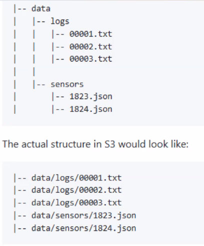

# Amazon S3 (Simple Storage Service)

Amazon S3 is AWS's object storage service — designed to store and retrieve any amount of data from anywhere on the internet.

---

## Everything is an Object

Unlike a traditional file system, S3 stores data as **objects**. Each object consists of two parts:

- **Data** — the file itself (an image, a video, a JSON document, a backup, etc.)
- **Metadata** — information *about* the file, such as its content type, size, and any custom tags you add

Every object is uniquely identified by a **key** — its name within the bucket. The combination of bucket + key always points to exactly one object, making every object in S3 unique.

Objects live inside **buckets** — think of a bucket as a top-level container, similar to a root folder. Bucket names must be **globally unique across all of AWS** — not just within your account, but across every AWS account worldwide. If a name is taken, it is taken for everyone. This means names like `my-bucket` or `test` are almost certainly already gone, so use something specific to your project.

---

## How Objects are Stored

S3 uses a **flat storage structure** — there are no real folders or directories. Instead, every object is stored at the bucket level and identified purely by its key.

What looks like a folder path (e.g. `images/profile/avatar.png`) is just a key with slashes in the name. The AWS console displays these as folders for readability, but underneath it is a single flat namespace.

When you store an object, S3 automatically distributes it across **multiple Availability Zones** within the chosen region — separate physical data centres with independent power and networking. This is what gives S3 its durability guarantee; even if an entire facility goes down, your data is unaffected.

Each object can be up to **5 TB** in size. Objects larger than 100 MB should be uploaded using **multipart upload**, which splits the file into chunks, uploads them in parallel, and reassembles them — making large uploads faster and more resilient to network interruptions.

---

## Secure

S3 buckets are **private by default** — nothing is publicly accessible unless you explicitly allow it. Access is controlled through:

- **IAM policies** — define which AWS users or roles can read, write, or delete objects
- **Bucket policies** — resource-level rules attached directly to the bucket
- **Encryption** — data can be encrypted at rest and in transit

### Making Objects Public

To make an object publicly accessible — for example, serving images to a web app or hosting a static site — you need to do two things:

1. **Disable Block Public Access** on the bucket (AWS enables this by default as a safety net)
2. **Attach a bucket policy** that explicitly grants public read permission

Without both steps, the object remains private even if you intend it to be public.

---

## Durable

S3 is designed for **99.999999999% (11 nines) durability**. AWS automatically replicates your data across multiple physical locations within a region, so a single hardware failure has no impact on your files.

---

## Scalable

There is no storage limit. You can store a single file or billions of them — S3 scales automatically without any configuration or capacity planning on your part.

---

## Versioning

S3 can keep every version of an object automatically. When versioning is enabled on a bucket, uploading a file with the same key does not overwrite the existing object — it creates a new version alongside it. Every version gets its own unique ID and can be retrieved, restored, or deleted independently.

This protects against two common problems:

- **Accidental overwrites** — the previous version is always recoverable
- **Accidental deletes** — deleting an object just adds a delete marker; the original versions remain intact

Versioning is disabled by default and must be explicitly enabled per bucket. Once enabled it cannot be fully disabled, only suspended.

---

## Storage Classes

Not all data is accessed equally. S3 offers different **storage classes** so you only pay for the level of availability and retrieval speed you actually need.

| Storage Class | Best For | Retrieval Speed |
| --- | --- | --- |
| **S3 Standard** | Frequently accessed data | Milliseconds |
| **S3 Intelligent-Tiering** | Data with unpredictable access patterns — AWS automatically moves objects between tiers based on usage | Milliseconds |
| **S3 Standard-IA** (Infrequent Access) | Data accessed occasionally but must be available immediately when needed | Milliseconds |
| **S3 One Zone-IA** | Infrequent access, but stored in a single AZ — cheaper, less resilient | Milliseconds |
| **S3 Glacier Instant Retrieval** | Archive data that still needs to be accessible quickly | Milliseconds |
| **S3 Glacier Flexible Retrieval** | Archive data where a wait is acceptable | Minutes to hours |
| **S3 Glacier Deep Archive** | Long-term cold storage — lowest cost option | Up to 12 hours |

The general rule: the less frequently you need your data, the cheaper it is to store — but the longer it takes to get it back.

---

## Common Use Cases

- **Static website hosting** — S3 can serve HTML, CSS, and JavaScript files directly to a browser, no server required
- **Media storage** — store and serve images, videos, and audio files for a web or mobile app
- **Backups and snapshots** — a cheap, durable destination for database backups, log archives, and disaster recovery files
- **Data pipeline storage** — act as the landing zone for raw data before it is processed and loaded into a database or warehouse
- **Software distribution** — host installers, build artefacts, or any file that needs to be downloaded at scale

---

## S3 is Not a Data Lake

S3 is often *used as* the foundation of a data lake, but it is not one by itself — it is just storage.

A **data lake** is a centralised repository for storing large volumes of raw data in any format — structured (CSVs, databases), semi-structured (JSON, logs), or unstructured (images, videos). The idea is to dump everything in first and figure out how to use it later.

S3 provides the storage layer, but a data lake also requires tools for cataloguing, querying, and governing that data. On AWS, services like **Athena** (query), **Glue** (catalogue and transform), and **Lake Formation** (governance) are what turn an S3 bucket into an actual data lake.

In short: S3 is a bucket of objects. A data lake is a system built on top of it.
