# Setting Up an EC2 Instance on AWS

Amazon EC2 (Elastic Compute Cloud) lets you rent virtual servers in the cloud. This guide walks through launching an Ubuntu instance and serving a web page via Nginx.

---

## 1. Sign In

Sign in to the AWS Management Console with your credentials.

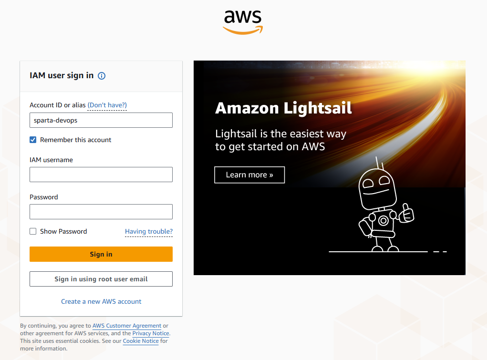

---

## 2. Select a Region

Once signed in, select the appropriate regional server from the top-right dropdown. Choose the region closest to your users for the best performance.

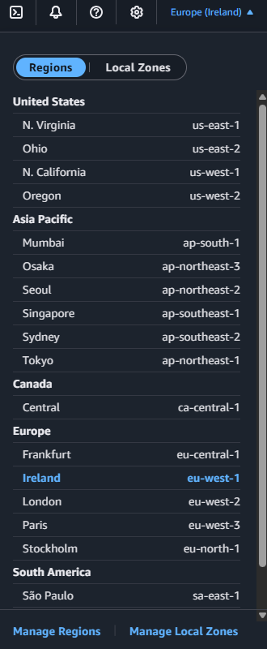

---

## 3. Create a Key Pair

A key pair is used to securely SSH into your instance. In the left-hand menu, navigate to **Network & Security → Key Pairs**.

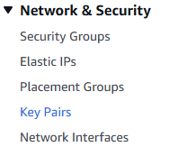

Click **Create Key Pair**.

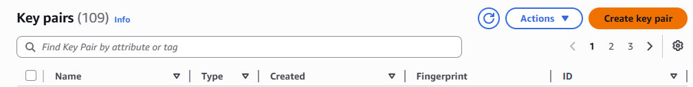

Give the key pair a name and leave the default settings, then click **Create**.

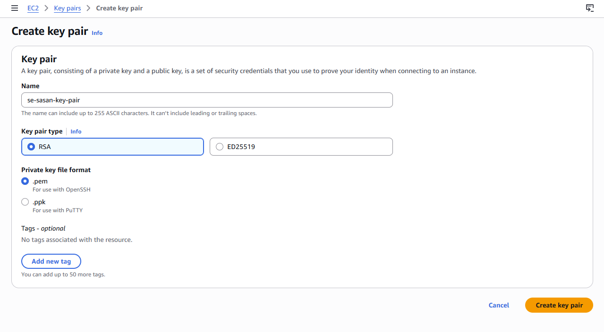

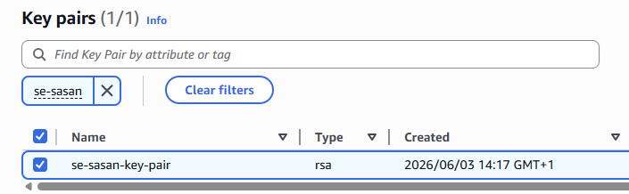

The `.pem` file will download automatically. Move it to your `.ssh` folder:

```
C:\Users\[your_username]\.ssh\
```

If the `.ssh` folder does not exist, create it manually, then move the `.pem` file into it.

---

## 4. Launch an Instance

In the left-hand menu, navigate to **Instances**.

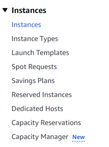

Click **Launch Instances**.

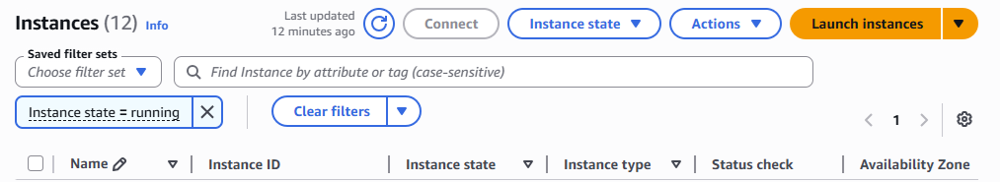

Give your server a name.

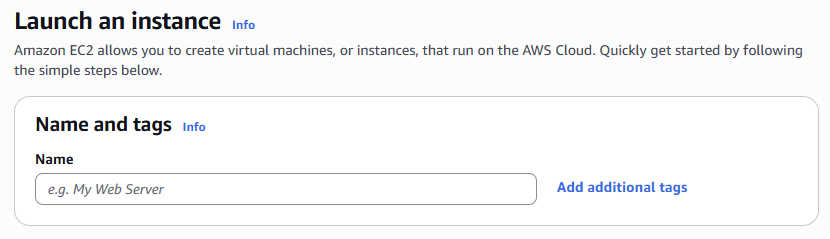

Scroll down to **Application and OS Images**, select **Ubuntu**, then change the version to **24.04** from the dropdown and confirm when prompted.

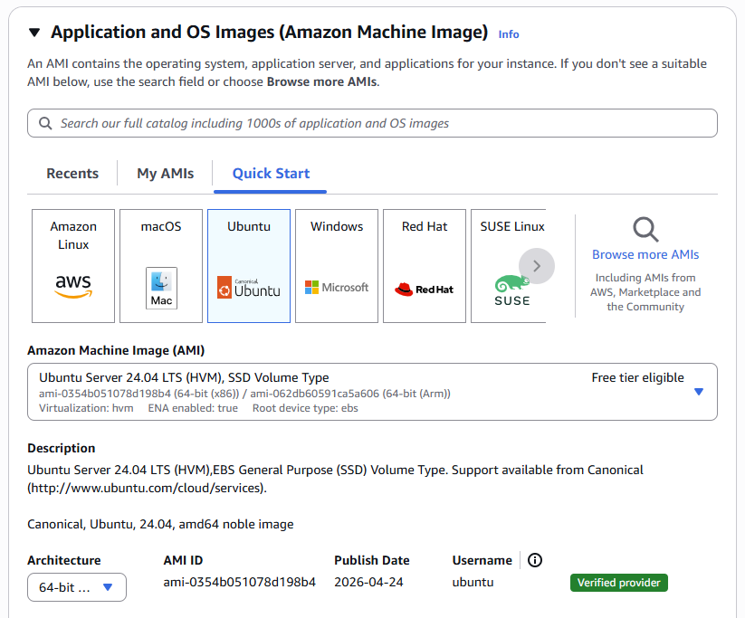

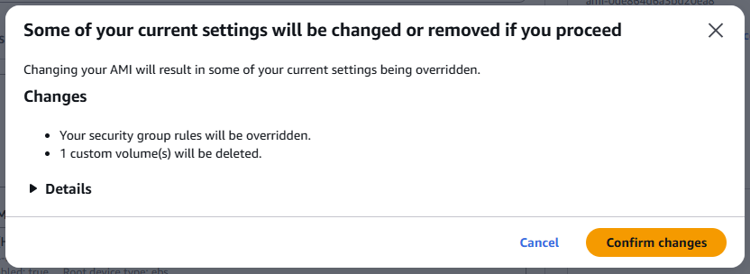

---

## 5. Configure Network Settings

Scroll down to **Network Settings** and click **Edit**. Give the security group a descriptive name.

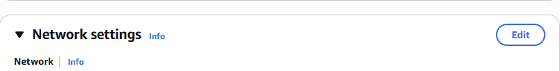

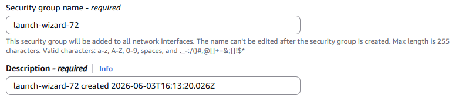

Click **Add Security Group Rule** and configure it as follows:

- **Port range:** 80
- **Source:** 0.0.0.0/0 *(allows public HTTP access — for this project only)*

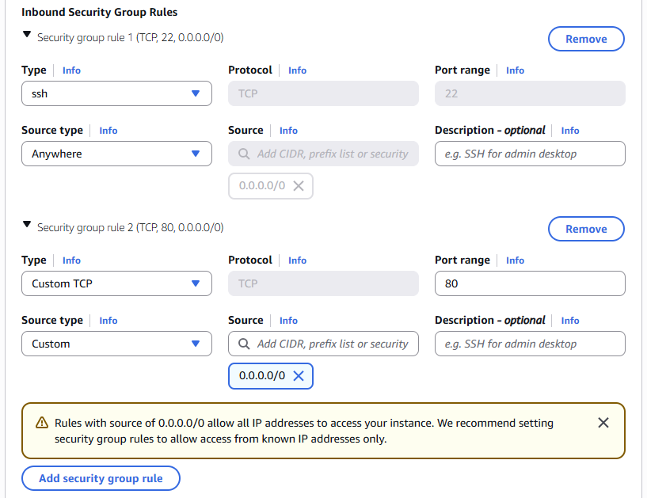

---

## 6. Select Key Pair and Launch

Scroll down to **Key Pair (login)** and select the key pair you created earlier.

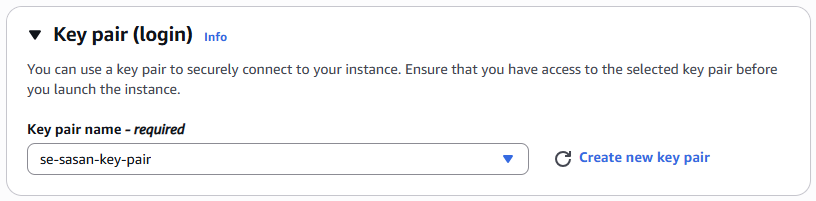

Review the summary on the right, then click **Launch Instance**.

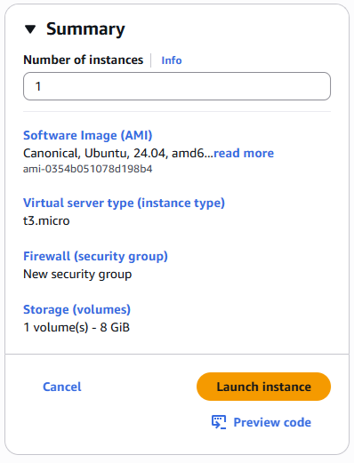

Once created, click the link in the success message to go to the instance dashboard.

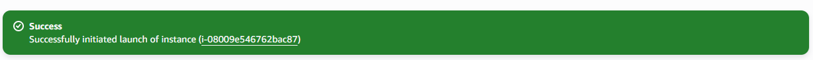

---

## 7. Connect via SSH

On the instance dashboard, click the **Connect** button at the top.

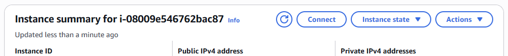

This opens a connection instructions page. Switch to the **SSH client** tab and keep it open for reference.

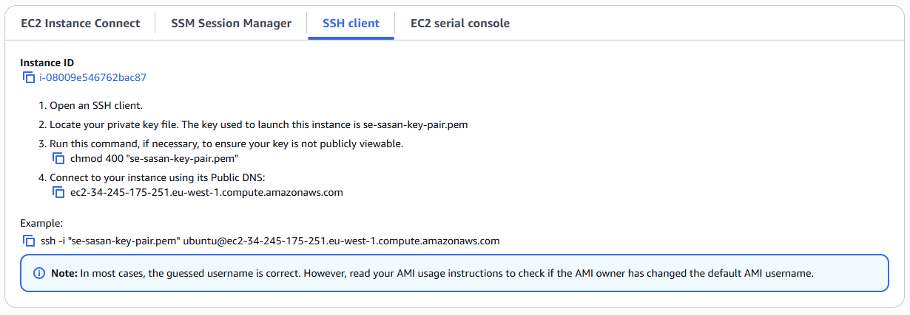

Open **Git Bash** (Windows) and navigate to your `.ssh` folder:

```bash
cd C:/Users/[your_username]/.ssh
```

Confirm your `.pem` file is present:

```bash
ls -a
```

Set the correct permissions on your key file:

```bash
chmod 400 "your-key-pair-name.pem"
```

Then connect to your instance using the SSH command shown on the instructions page:

```bash
ssh -i "your-key-pair-name.pem" ubuntu@<your-public-ip>
```

Verify the connection with:

```bash
whoami
```

You should see `ubuntu` printed in the console.

---

## 8. Install and Verify Nginx

Run the following commands in sequence:

```bash
sudo apt update -y       # refreshes the package list from Ubuntu's repositories
sudo apt upgrade -y      # upgrades all installed packages to their latest versions
sudo apt install nginx -y  # installs the Nginx web server
sudo systemctl status nginx  # confirms Nginx is active and running
```

You should see the Nginx service reported as **active (running)**.

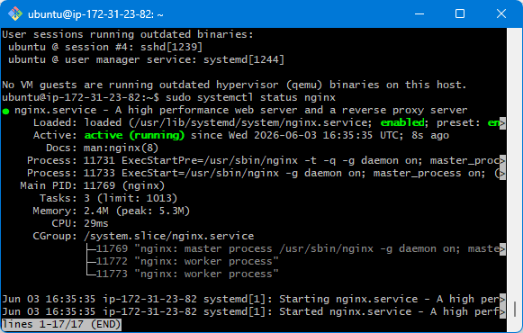

Return to the instance dashboard and copy the **Public IPv4 address**. Paste it into your browser — make sure the URL starts with `http://` not `https://` (some browsers add the `s` automatically).

You should see the default Nginx welcome page, confirming the server is live.

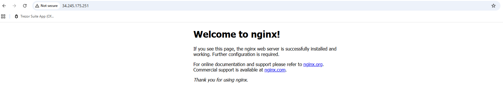
